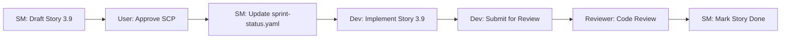

# Sprint Change Proposal (SCP) #10
**Date:** 2025-12-10
**Proposed by:** Scrum Master (Bob) via *correct-course workflow
**Trigger:** User-reported issue in tenant onboarding flow
**Mode:** Batch (complete proposal for bulk review)

---

## Executive Summary

**Issue:** Tenant onboarding Step 3 displays error "No primary bank account configured. Please contact admin to set up a bank account." Users cannot select from multiple bank accounts during tenant creation.

**Root Cause:** Story 3.3 (Tenant Onboarding) implementation added bank account field not specified in original ACs. Story 6.5 (Bank Account Management) completed but not integrated with tenant onboarding.

**Proposed Solution:** Add Story 3.9 to Epic 3 - "Tenant Onboarding Bank Account Integration" to enable bank account dropdown selection in Step 3.

**Impact:** Low effort (1-2 days), low risk, no MVP impact, quick win to close feature gap.

---

## Section 1: Identified Issue

### 1.1 Problem Statement

The tenant onboarding wizard (`/tenants/create`) Step 3 shows "Company Bank Account" field with error message:

> "No primary bank account configured. Please contact admin to set up a bank account."

**Symptoms:**
- Admin users cannot select bank account during tenant creation
- Error message appears instead of bank account dropdown
- No integration between tenant creation and bank account management (Story 6.5)

### 1.2 Discovery Context

- **Trigger**: User-reported production issue (not tied to specific story)
- **Review of Story 3.3**: Step 3 ACs specify "Rent Breakdown" - NO mention of bank account selection
- **Review of Story 6.5**: Bank Account Management completed 2025-11-29 with CRUD interface at `/settings/bank-accounts`
- **Gap**: Implementation added bank account field to tenant form but:
  1. Not in original Story 3.3 requirements
  2. No API integration with bank account service
  3. No dropdown component for bank account selection

### 1.3 Evidence

**Story 3.3 (Tenant Onboarding) - Step 3 Acceptance Criteria:**
```
**Step 3: Rent Breakdown**
- Base rent (decimal, required)
- Admin fee (decimal, optional)
- Service charge (decimal, optional)
- Security deposit (decimal, required)
- Total monthly rent (auto-calculated)
```
❌ **No bank account selection mentioned**

**Story 6.5 (Bank Account Management):**
- ✅ Completed 2025-11-29
- ✅ Backend: `BankAccount` entity, service, controller (8 endpoints)
- ✅ Frontend: `/settings/bank-accounts` page with CRUD for Admin/Super Admin
- ❌ **Not integrated with tenant onboarding**

**User Report:**
- Error message on tenant creation Step 3
- Request for bank account dropdown to select from multiple configured accounts

---

## Section 2: Epic Impact and Artifact Adjustments

### 2.1 Epic Impact Assessment

**Epic 3: Tenant Management & Portal**
- **Status**: In progress (Story 3.8 complete, E2E stories pending)
- **Impact**: ✏️ **MODIFICATION NEEDED**
- **Action**: Add Story 3.9 - "Tenant Onboarding Bank Account Integration"
- **Justification**: Closes feature gap between tenant onboarding (Story 3.3) and bank account management (Story 6.5)

**Other Epics:**
- ✅ Epic 4-9: No impact (independent functionality)

### 2.2 Artifact Adjustment Needs

#### PRD Updates Required

**PRD Section 3.3.3 - Tenant Information Collection**

**CURRENT STATE:**
```
**Step 3: Financial Information**
- Base rent amount
- Security deposit
- Payment terms (monthly, quarterly, annually)
- Payment method (bank transfer, cash, cheque, PDC)
```

**PROPOSED UPDATE:**
```diff
**Step 3: Financial Information**
- Base rent amount
- Security deposit
- Payment terms (monthly, quarterly, annually)
- Payment method (bank transfer, cash, cheque, PDC)
+ Company Bank Account (dropdown, optional):
+   - Select from configured bank accounts (Story 6.5)
+   - Display format: "Bank Name - Account Name (**** XXXX)"
+   - Used for rent payment instructions on invoices
+   - If not selected, invoice shows generic payment instructions
```

**Rationale:** Adds explicit requirement for bank account selection to align PRD with implementation.

#### Architecture Updates

**CURRENT STATE:**
- `Tenant` entity does NOT have `bankAccountId` foreign key
- No integration between `TenantService` and `BankAccountService`

**PROPOSED UPDATES:**

**Database Migration (V68):**
```sql
ALTER TABLE tenants ADD COLUMN bank_account_id UUID NULL;
ALTER TABLE tenants ADD CONSTRAINT fk_tenants_bank_account
  FOREIGN KEY (bank_account_id) REFERENCES bank_accounts(id) ON DELETE SET NULL;
CREATE INDEX idx_tenants_bank_account_id ON tenants(bank_account_id);
```

**Tenant Entity:**
```java
@Entity
@Table(name = "tenants")
public class Tenant {
    // ... existing fields

    @ManyToOne(fetch = FetchType.LAZY)
    @JoinColumn(name = "bank_account_id")
    private BankAccount bankAccount;

    // getter/setter
}
```

**API Changes:**
- Update `TenantRequest` DTO to include `bankAccountId` (optional)
- Update `TenantResponse` DTO to include `bankAccount` (nested object with id, bankName, accountName, maskedAccountNumber)
- Modify `TenantServiceImpl.createTenant()` to validate and link bank account

#### UI/UX Updates

**CURRENT STATE:**
- Step 3 shows error message: "No primary bank account configured..."
- No bank account dropdown

**PROPOSED UPDATES:**

**Tenant Onboarding Step 3 Wizard:**
```tsx
// Add bank account selection after security deposit field
<FormField
  control={form.control}
  name="bankAccountId"
  render={({ field }) => (
    <FormItem>
      <FormLabel>Company Bank Account (Optional)</FormLabel>
      <Select onValueChange={field.onChange} value={field.value}>
        <FormControl>
          <SelectTrigger data-testid="select-bank-account">
            <SelectValue placeholder="Select bank account for rent payments" />
          </SelectTrigger>
        </FormControl>
        <SelectContent>
          {bankAccounts.map((account) => (
            <SelectItem key={account.id} value={account.id}>
              {account.bankName} - {account.accountName} (**** {account.accountNumber.slice(-4)})
            </SelectItem>
          ))}
        </SelectContent>
      </Select>
      <FormDescription>
        Select the bank account for rent payment instructions on invoices
      </FormDescription>
      <FormMessage />
    </FormItem>
  )}
/>
```

**Required Changes:**
1. ❌ **Remove**: Error message for missing bank accounts
2. ✅ **Add**: Dropdown populated from `GET /api/v1/bank-accounts`
3. ✅ **Add**: `useBankAccounts()` React Query hook to fetch accounts
4. ✅ **Add**: Loading state while fetching bank accounts
5. ✅ **Add**: Graceful handling if no bank accounts configured (show empty state with link to settings)

#### Testing Strategy Updates

**New Test Requirements:**

**Backend (TenantServiceTest.java):**
- Test tenant creation with valid bank account ID
- Test tenant creation with null bank account ID (optional field)
- Test tenant creation with invalid bank account ID (should fail validation)
- Test tenant update to change bank account

**Frontend (Validation):**
- Test bank account dropdown renders with fetched accounts
- Test bank account dropdown handles empty state
- Test form submission with selected bank account
- Test form submission without bank account (should succeed - optional field)

**E2E (tenant-onboarding.spec.ts):**
- Test complete tenant onboarding flow with bank account selection
- Test tenant onboarding flow without bank account selection
- Test bank account dropdown displays masked account numbers

---

## Section 3: Recommended Path Forward

### 3.1 Selected Approach

**Option 1: Direct Adjustment - Add Story 3.9**

**Approach:** Create new story within Epic 3 to integrate bank account selection into tenant onboarding.

**Rationale:**
1. **Low Implementation Effort**: Bank account management complete - reuse existing API and patterns
2. **Low Technical Risk**: No new architecture, simple foreign key relationship
3. **High Business Value**: Enables proper rent payment tracking from onboarding
4. **Team Momentum**: Quick win (1-2 days), maintains velocity
5. **No MVP Impact**: Enhancement to existing functionality, not core blocker

**Effort Estimate:** 🟢 **LOW** (1-2 days)
**Risk Level:** 🟢 **LOW**
**Timeline Impact:** ✅ **MINIMAL**

### 3.2 Alternative Approaches Considered

**Option 2: Rollback Story 3.3 Implementation**
- ❌ **REJECTED**: Bank account selection is valuable feature, should be completed not removed

**Option 3: PRD MVP Scope Reduction**
- ❌ **NOT NEEDED**: MVP achievable with Option 1, no scope reduction required

---

## Section 4: PRD MVP Impact

### 4.1 MVP Status

✅ **MVP NOT AFFECTED**

**Rationale:**
- Bank account selection is data capture enhancement, not core MVP functionality
- Tenant onboarding works without bank account (optional field)
- Quick integration story does not delay MVP timeline

### 4.2 High-Level Action Plan

**Phase 1: Story Creation (Immediate)**
1. Create Story 3.9 in `docs/sprint-artifacts/epic-3/3-9-tenant-onboarding-bank-account-integration.md`
2. Update `docs/sprint-artifacts/sprint-status.yaml` to add story 3.9 as "drafted"
3. Update PRD Section 3.3.3 with bank account selection requirement

**Phase 2: Implementation (1-2 days)**
1. **Backend**:
   - Create Flyway migration V68 to add `bank_account_id` to `tenants` table
   - Update `Tenant` entity with `@ManyToOne` relationship to `BankAccount`
   - Update `TenantRequest` DTO to accept `bankAccountId` (optional)
   - Update `TenantResponse` DTO to return bank account details
   - Update `TenantServiceImpl` to validate and link bank account
   - Add unit tests to `TenantServiceTest`
2. **Frontend**:
   - Add `bankAccountId` to tenant form schema (optional field)
   - Import `useBankAccounts()` hook in tenant creation page
   - Add bank account dropdown to Step 3 (FinancialInfoStep)
   - Add empty state handling if no bank accounts configured
   - Add validation tests
3. **E2E**:
   - Update `tenant-onboarding.spec.ts` with bank account selection test cases

**Phase 3: Testing and Validation (1 day)**
1. Backend tests: All tenant service tests pass
2. Frontend tests: Validation and component tests pass
3. E2E tests: Complete tenant onboarding flow with/without bank account selection
4. Manual testing: Verify dropdown, empty state, form submission

**Phase 4: Code Review and Deployment**
1. Submit PR for Story 3.9
2. Code review by Senior Dev
3. Merge to main
4. Update `sprint-status.yaml`: 3.9 status to "done"

**Dependencies:**
- Story 6.5 (Bank Account Management) - ✅ Complete (prerequisite met)
- Story 3.3 (Tenant Onboarding) - ✅ Complete (will be enhanced)

**Sequencing:**
1. Story 3.9 can start immediately (all prerequisites complete)
2. No blocking dependencies

---

## Section 5: Agent Handoff Plan

### 5.1 Roles and Responsibilities

**Scrum Master (Bob) - *sm agent:**
- ✅ Draft Story 3.9 using *create-story workflow
- ✅ Update sprint-status.yaml with new story
- ✅ Facilitate story review and approval

**Developer Agent - *dev:**
- Execute Story 3.9 implementation using *dev-story workflow
- Backend: Migration, entity updates, service layer, tests
- Frontend: Form updates, bank account dropdown, validation
- E2E: Test case updates

**Product Manager / Architect Agent - *pm / *architect:**
- ❌ **NOT REQUIRED** - No strategic or architectural changes needed
- Story 3.9 uses existing patterns and architecture

**Code Reviewer Agent - *code-review:**
- Review completed Story 3.9 implementation
- Validate all acceptance criteria met
- Check test coverage and code quality

### 5.2 Handoff Sequence



**Handoff #1: SM → User**
- Deliverable: This Sprint Change Proposal (SCP #10)
- Action Required: User approval to proceed

**Handoff #2: SM → Dev**
- Deliverable: Story 3.9 markdown file (drafted and approved)
- Action Required: Dev implements Story 3.9 using *dev-story

**Handoff #3: Dev → Reviewer**
- Deliverable: PR with implementation + tests
- Action Required: Code review using *code-review

**Handoff #4: Reviewer → SM**
- Deliverable: Approved code review
- Action Required: SM marks story "done" in sprint-status.yaml

---

## Section 6: Proposed Story 3.9 Summary

### Story Title
**3.9 - Tenant Onboarding Bank Account Integration**

### Story Description
As an Admin or Property Manager creating a new tenant,
I want to select a company bank account during onboarding Step 3,
So that rent payment instructions on invoices reference the correct bank account.

### Key Acceptance Criteria (Summary)

**Backend:**
- AC1: Add `bank_account_id` foreign key to `tenants` table (nullable)
- AC2: Update `Tenant` entity with `@ManyToOne` relationship to `BankAccount`
- AC3: Update `TenantRequest` DTO to accept `bankAccountId` (optional)
- AC4: Update `TenantResponse` DTO to include bank account details (bankName, accountName, masked number)
- AC5: Validate bank account exists if provided (foreign key constraint)

**Frontend:**
- AC6: Add bank account dropdown to Step 3 of tenant onboarding wizard
- AC7: Populate dropdown from `GET /api/v1/bank-accounts`
- AC8: Display format: "Bank Name - Account Name (**** XXXX)"
- AC9: Show empty state if no bank accounts configured with link to `/settings/bank-accounts`
- AC10: Mark field as optional (form can be submitted without selection)
- AC11: Add loading state while fetching bank accounts

**Testing:**
- AC12: Backend unit tests for tenant creation with/without bank account
- AC13: Frontend validation tests for bank account dropdown
- AC14: E2E test for complete tenant onboarding with bank account selection

### Prerequisites
- ✅ Story 6.5 (Bank Account Management) - Complete

### Effort Estimate
**1-2 days** (Low complexity, reuse existing patterns)

---

## Approval and Next Steps

### Approval Checklist

**Sprint Change Proposal:**
- ✅ Issue identified and documented with evidence
- ✅ Epic impact assessed (Epic 3 modification only)
- ✅ Artifact conflicts analyzed (PRD, Architecture, UI/UX)
- ✅ Path forward evaluated (Option 1: Direct Adjustment recommended)
- ✅ MVP impact confirmed (not affected)
- ✅ Action plan defined with clear phases
- ✅ Agent handoff plan established

**Ready for User Approval:**
- [ ] User reviews Sprint Change Proposal
- [ ] User approves/rejects/requests modifications
- [ ] If approved: Proceed to Story 3.9 creation

### Next Steps (Pending Approval)

**IF APPROVED:**
1. SM creates Story 3.9 markdown file using *create-story
2. SM updates sprint-status.yaml: Add 3.9-tenant-onboarding-bank-account-integration: drafted
3. SM hands off to Dev agent for implementation
4. Dev executes Story 3.9 using *dev-story workflow
5. Code review via *code-review workflow
6. SM marks story "done" upon completion

**IF REJECTED/MODIFICATIONS NEEDED:**
- SM addresses user feedback
- Revise SCP and resubmit for approval

---

## Document Metadata

**SCP ID:** SCP-2025-12-10-bank-account-integration
**Created:** 2025-12-10
**Author:** Scrum Master (Bob)
**Workflow:** .bmad/bmm/workflows/4-implementation/correct-course/workflow.yaml
**Status:** ⏳ **PENDING USER APPROVAL**
**Related Stories:** 3.3 (Tenant Onboarding), 6.5 (Bank Account Management)
**Related Epics:** Epic 3 (Tenant Management)

---

**End of Sprint Change Proposal #10**
