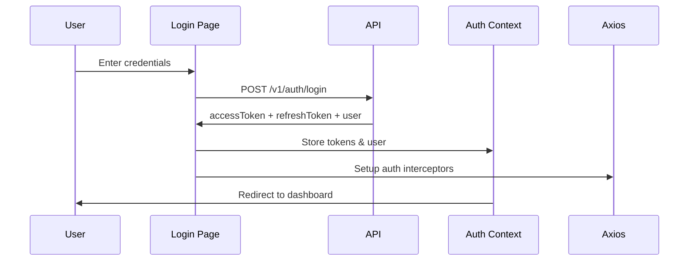

# Authentication System Documentation

## Overview

Ultra BMS implements a comprehensive authentication system with JWT-based authentication, role-based access control (RBAC), and session management. This document provides a complete guide for developers working with the authentication system.

## Table of Contents

1. [Architecture](#architecture)
2. [Authentication Flow](#authentication-flow)
3. [API Integration](#api-integration)
4. [Components](#components)
5. [Hooks](#hooks)
6. [Route Protection](#route-protection)
7. [Security Features](#security-features)
8. [Testing](#testing)

---

## Architecture

### Tech Stack

- **Frontend Framework**: Next.js 16 (App Router)
- **State Management**: React Context API
- **Form Validation**: React Hook Form + Zod
- **HTTP Client**: Axios
- **UI Components**: shadcn/ui (Radix UI + Tailwind CSS)
- **Password Strength**: zxcvbn
- **JWT Utilities**: jwt-decode

### Key Directories

```
frontend/src/
├── app/
│   ├── (auth)/               # Authentication pages
│   │   ├── login/
│   │   ├── register/
│   │   ├── forgot-password/
│   │   └── reset-password/
│   └── (dashboard)/
│       └── settings/security/ # Security settings
├── components/
│   ├── auth/                  # Auth-specific components
│   ├── forms/                 # Reusable form components
│   └── layout/                # Layout components
├── contexts/
│   └── auth-context.tsx       # Authentication context
├── lib/
│   ├── api.ts                 # Axios client with interceptors
│   ├── auth-api.ts            # Auth API service
│   └── jwt-utils.ts           # JWT helper functions
├── schemas/
│   └── authSchemas.ts         # Zod validation schemas
├── types/
│   └── auth.ts                # TypeScript types
└── middleware.ts              # Route protection middleware
```

---

## Authentication Flow

### 1. Login Flow



**Implementation:**

```typescript
// Usage in Login Page
const { login } = useAuth();

const onSubmit = async (data: LoginFormData) => {
  await login(data.email, data.password, data.rememberMe);
  router.push('/dashboard');
};
```

### 2. Token Refresh Flow

Access tokens expire after 1 hour. The system automatically refreshes them using the refresh token (valid for 7 days).

```typescript
// Automatic refresh in Axios interceptor (lib/api.ts)
apiClient.interceptors.response.use(
  response => response,
  async (error) => {
    if (error.response?.status === 401) {
      // Attempt token refresh
      const newToken = await refreshAccessToken();
      // Retry original request with new token
      return apiClient(originalRequest);
    }
  }
);
```

### 3. Session Restoration

On page load, the system attempts to restore the session:

```typescript
// In AuthProvider (contexts/auth-context.tsx)
useEffect(() => {
  const restoreSession = async () => {
    const response = await authApi.refreshAccessToken();
    if (response.success) {
      setAccessToken(response.data.accessToken);
      setUser(getUserFromToken(response.data.accessToken));
    }
  };
  restoreSession();
}, []);
```

---

## API Integration

### Auth API Service

All authentication-related API calls are centralized in `lib/auth-api.ts`:

```typescript
import * as authApi from '@/lib/auth-api';

// Login
await authApi.login({ email, password, rememberMe });

// Register
await authApi.register(userData);

// Forgot Password
await authApi.forgotPassword({ email });

// Reset Password
await authApi.resetPassword({ token, newPassword, confirmPassword });

// Change Password
await authApi.changePassword({ currentPassword, newPassword, confirmPassword });

// Get Active Sessions
const sessions = await authApi.getActiveSessions();

// Revoke Session
await authApi.revokeSession(sessionId);

// Logout All Devices
await authApi.logoutAllDevices();
```

### CSRF Protection

CSRF tokens are automatically handled by the Axios interceptor:

```typescript
// Request interceptor adds CSRF token to state-changing requests
if (isStateChangingMethod && csrfToken) {
  config.headers['X-XSRF-TOKEN'] = csrfToken;
}

// Response interceptor extracts CSRF token from headers
const csrfToken = response.headers['x-xsrf-token'];
if (csrfToken) {
  setCSRFToken(csrfToken);
}
```

---

## Components

### Authentication Pages

#### 1. Login Page (`app/(auth)/login/page.tsx`)

Features:
- Email and password fields with validation
- "Remember me" checkbox (extends refresh token to 7 days)
- Password visibility toggle
- Forgot password link
- Error handling with specific messages

#### 2. Registration Page (`app/(auth)/register/page.tsx`)

Features:
- First name, last name, email, phone fields
- Password strength meter (zxcvbn)
- Password requirements checklist
- Terms of service acceptance
- Real-time validation

#### 3. Forgot Password (`app/(auth)/forgot-password/page.tsx`)

Features:
- Email input
- Success state with instructions
- Rate limiting handling

#### 4. Reset Password (`app/(auth)/reset-password/page.tsx`)

Features:
- Token validation on load
- New password with strength meter
- Confirm password matching
- Success state with auto-redirect

#### 5. Security Settings (`app/(dashboard)/settings/security/page.tsx`)

Features:
- Change password form
- Active sessions management
- Session revocation
- Logout all devices

### Form Components

Located in `components/forms/`:

#### PasswordInput
```typescript
<PasswordInput
  placeholder="Enter password"
  autoComplete="current-password"
  error={!!errors.password}
  {...field}
/>
```

#### PasswordStrengthMeter
```typescript
<PasswordStrengthMeter
  password={password}
  showRequirements={true}
  showFeedback={true}
/>
```

#### SubmitButton
```typescript
<SubmitButton
  isLoading={isSubmitting}
  loadingText="Signing in..."
>
  Sign in
</SubmitButton>
```

#### AuthLayout
```typescript
<AuthLayout
  title="Sign in to your account"
  description="Enter your credentials"
  footer={<Link href="/register">Sign up</Link>}
>
  {/* Form content */}
</AuthLayout>
```

---

## Hooks

### useAuth()

Main authentication hook providing auth state and actions:

```typescript
const {
  user,              // Current user object
  isAuthenticated,   // Boolean: is user logged in?
  isLoading,         // Boolean: is auth loading?
  login,             // Function: login(email, password, rememberMe)
  register,          // Function: register(userData)
  logout,            // Function: logout()
  refreshToken,      // Function: refreshToken()
  updateAccessToken, // Function: updateAccessToken(token)
} = useAuth();
```

### useUser()

Simplified hook for accessing current user:

```typescript
const { user, isLoading } = useUser();
```

### usePermission()

Hook for checking user permissions and roles:

```typescript
const {
  hasPermission,       // (permission: string) => boolean
  hasAnyPermission,    // (permissions: string[]) => boolean
  hasAllPermissions,   // (permissions: string[]) => boolean
  hasRole,             // (role: string) => boolean
  hasAnyRole,          // (roles: string[]) => boolean
} = usePermission();

// Usage examples
if (hasRole('SUPER_ADMIN')) {
  // Show admin features
}

if (hasPermission('MANAGE_USERS')) {
  // Show user management
}

if (hasAnyRole(['PROPERTY_MANAGER', 'MAINTENANCE_SUPERVISOR'])) {
  // Show work orders
}
```

---

## Route Protection

### Server-Side Protection (Middleware)

The middleware (`src/middleware.ts`) protects routes at the server level:

```typescript
// Automatically applied to all routes except:
// - Public routes (login, register, forgot-password, reset-password)
// - Static files
// - API routes

// Redirects:
// - Unauthenticated users → /login
// - Authenticated users on auth pages → /dashboard
```

**Configuration:**
```typescript
export const config = {
  matcher: [
    '/((?!_next/static|_next/image|favicon.ico|.*\\..*|api).*)',
  ],
};
```

### Client-Side Protection (ProtectedRoute Component)

For fine-grained permission checks:

```typescript
import { ProtectedRoute } from '@/components/auth';

// Protect entire page
export default function AdminPage() {
  return (
    <ProtectedRoute requiredRole="SUPER_ADMIN">
      <AdminContent />
    </ProtectedRoute>
  );
}

// Multiple role options
<ProtectedRoute requiredRoles={['PROPERTY_MANAGER', 'FINANCE_MANAGER']}>
  <FinancialReports />
</ProtectedRoute>

// Permission-based
<ProtectedRoute requiredPermission="MANAGE_PROPERTIES">
  <PropertyManagement />
</ProtectedRoute>

// Multiple permissions (any)
<ProtectedRoute
  requiredPermissions={['VIEW_REPORTS', 'GENERATE_REPORTS']}
  requireAllPermissions={false}
>
  <ReportsDashboard />
</ProtectedRoute>

// Multiple permissions (all required)
<ProtectedRoute
  requiredPermissions={['VIEW_USERS', 'EDIT_USERS']}
  requireAllPermissions={true}
>
  <UserManagement />
</ProtectedRoute>

// Custom fallback URL
<ProtectedRoute
  requiredRole="ADMIN"
  fallbackUrl="/unauthorized"
>
  <AdminPanel />
</ProtectedRoute>
```

### 403 Forbidden Page

Automatically shown when users lack required permissions:

```
/app/403/page.tsx
```

---

## Security Features

### 1. Token Storage

- **Access Token**: Stored in memory (React state) - NOT in localStorage to prevent XSS attacks
- **Refresh Token**: Stored in HTTP-only cookie - NOT accessible to JavaScript

### 2. CSRF Protection

- CSRF tokens automatically added to state-changing requests (POST, PUT, DELETE, PATCH)
- Tokens extracted from response headers and stored for subsequent requests

### 3. Password Security

- Minimum requirements:
  - 8 characters minimum
  - 1 uppercase letter
  - 1 lowercase letter
  - 1 number
  - 1 special character
- Password strength analysis using zxcvbn
- Visual feedback with strength meter
- Reject common/weak passwords

### 4. Session Management

- Access token: 1 hour lifetime
- Refresh token: 7 days lifetime (14 days with "Remember me")
- Idle timeout: 30 minutes
- Absolute timeout: 12 hours
- Max concurrent sessions: 3 devices
- Session expiry warning at 5 minutes remaining

### 5. Rate Limiting (Backend)

- Login attempts: 5 per 15 minutes per email
- Password reset requests: 3 per hour per email
- Account lockout: 30 minutes after 5 failed login attempts

### 6. Security Headers

Set in Axios configuration:
- X-Content-Type-Options: nosniff
- X-Frame-Options: DENY
- Strict-Transport-Security
- Content-Security-Policy

---

## Testing

### Test Infrastructure

The testing suite uses:
- **Playwright** - E2E testing framework
- **@faker-js/faker** - Test data generation
- **Custom fixtures** - Reusable test helpers (userFactory, authHelper)

### Running E2E Tests

```bash
# Run all authentication tests
npm run test:e2e

# Run specific test file
npm run test:e2e -- tests/e2e/login.spec.ts
npm run test:e2e -- tests/e2e/registration.spec.ts
npm run test:e2e -- tests/e2e/password-reset.spec.ts
npm run test:e2e -- tests/e2e/session-management.spec.ts
npm run test:e2e -- tests/e2e/protected-routes.spec.ts

# Run with UI (watch mode)
npm run test:e2e:ui

# Run in headed mode (see browser)
npm run test:e2e:headed

# Debug specific test
npm run test:e2e:debug -- tests/e2e/login.spec.ts

# Generate HTML report
npm run test:e2e:report
```

### Test Coverage

#### Login Flow Tests (`tests/e2e/login.spec.ts`)
✅ **UI and Validation**
  - Display all form elements (email, password, remember me, links)
  - Show validation errors for empty/invalid inputs
  - Toggle password visibility
  - Accessible form labels and attributes

✅ **Successful Authentication**
  - Login with valid credentials
  - Persist "Remember Me" preference
  - Redirect to intended page after login
  - Store tokens securely

✅ **Authentication Errors**
  - Invalid credentials error message
  - Non-existent user handling
  - Network error handling
  - Server error handling

✅ **UI/UX Features**
  - Loading states during submission
  - Keyboard accessibility
  - Auto-focus email input
  - Clear password after failed login

✅ **Security**
  - CSRF token inclusion in requests
  - Rate limiting enforcement

#### Registration Flow Tests (`tests/e2e/registration.spec.ts`)
✅ **UI and Form Elements**
  - Display all required fields
  - Password strength meter
  - Password requirements checklist
  - Terms acceptance checkbox

✅ **Successful Registration**
  - Register with all valid data
  - Register with minimum required fields
  - Email verification flow

✅ **Password Validation**
  - Weak/strong password indicators
  - Reject passwords missing:
    - Uppercase letter
    - Lowercase letter
    - Number
    - Special character
    - Minimum 8 characters
  - Passwords must match validation

✅ **Form Validation**
  - All required fields validation
  - Email format validation
  - Name length validation
  - Phone number format (if provided)
  - Terms acceptance requirement

✅ **Server-Side Validation**
  - Duplicate email detection
  - Server error handling

✅ **UI/UX Features**
  - Loading states
  - Password visibility toggle
  - Dynamic requirements checklist updates
  - Keyboard navigation

#### Password Reset Tests (`tests/e2e/password-reset.spec.ts`)
✅ **Happy Path**
  - Complete password reset flow
  - Token validation
  - Password strength indicator
  - Success redirect to login

✅ **Error Scenarios**
  - Non-existent email (security: no reveal)
  - Invalid/expired token
  - Weak password rejection
  - Password mismatch error

✅ **Rate Limiting**
  - Enforce 3 requests per hour limit

✅ **Token Management**
  - Invalidate previous tokens
  - Prevent token reuse after success

✅ **UI/UX**
  - Password visibility toggle
  - Loading states
  - Countdown timer (15 min expiry)

#### Session Management Tests (`tests/e2e/session-management.spec.ts`)
✅ **Token Refresh**
  - Automatic access token refresh
  - Handle refresh token expiration
  - Maintain session across page refreshes

✅ **Session Expiry Warning**
  - Show warning 5 minutes before expiry
  - Countdown timer
  - "Stay Logged In" extends session
  - Auto-logout on timeout

✅ **Active Sessions**
  - Display list of active sessions
  - Show current session badge
  - Revoke specific session
  - Logout from all other devices
  - Auto-refresh session list (30s interval)

✅ **Change Password**
  - Successfully change password
  - Reject wrong current password
  - Validate new password requirements
  - Login with new password

✅ **Logout**
  - Clear session and cookies
  - Redirect to login
  - Block access to protected routes

✅ **CSRF Protection**
  - Include CSRF token in state-changing requests

#### Protected Routes & RBAC Tests (`tests/e2e/protected-routes.spec.ts`)
✅ **Unauthenticated Access**
  - Redirect to login from protected routes
  - Preserve intended URL
  - Allow public route access
  - Redirect authenticated users from auth pages

✅ **Middleware Protection**
  - Server-side route blocking
  - Check auth on every navigation
  - No content flash before redirect

✅ **Role-Based Access Control**
  - SUPER_ADMIN access to admin pages
  - TENANT denied admin access
  - 403 Forbidden page display
  - PROPERTY_MANAGER property access
  - VENDOR denied financial reports

✅ **Permission-Based Control**
  - MANAGE_USERS permission check
  - Deny without required permission
  - Conditional UI element rendering
  - Hide elements based on permissions

✅ **Multiple Roles & Permissions**
  - Grant access with ANY required role
  - Deny with NONE of required roles

✅ **Client-Side Protection**
  - Loading skeleton during auth check
  - No content flash before redirect

✅ **Edge Cases**
  - Handle invalid/malformed tokens
  - Concurrent auth requests
  - Authentication across tabs
  - Role/permission changes mid-session

### Test Statistics

**Total Test Files:** 5
**Total Test Cases:** 100+

| Test Suite | Test Cases | Coverage |
|------------|-----------|----------|
| Login Flow | 20+ | Complete |
| Registration | 25+ | Complete |
| Password Reset | 15+ | Complete |
| Session Management | 20+ | Complete |
| Protected Routes & RBAC | 20+ | Complete |

### Manual Testing Checklist

#### Authentication Pages
- [ ] Login with valid credentials
- [ ] Login with invalid credentials
- [ ] "Remember me" functionality
- [ ] Password visibility toggle
- [ ] Registration with all fields
- [ ] Password strength validation
- [ ] Terms acceptance requirement
- [ ] Forgot password email sending
- [ ] Password reset with valid token
- [ ] Password reset with expired token

#### Session Management
- [ ] Change password in settings
- [ ] View active sessions
- [ ] Revoke specific session
- [ ] Logout all other devices
- [ ] Session expiry warning (5 min before)
- [ ] Auto-logout on session expiry
- [ ] Token refresh on expiry
- [ ] Session persists across page refresh

#### Authorization
- [ ] Protected route access denied (unauthenticated)
- [ ] 403 page display (unauthorized)
- [ ] RBAC - admin access for SUPER_ADMIN
- [ ] RBAC - deny TENANT admin access
- [ ] Permission checks work correctly
- [ ] Conditional UI elements based on permissions

#### Security
- [ ] CSRF tokens sent with POST requests
- [ ] Tokens stored securely (access in memory, refresh in HTTP-only cookie)
- [ ] No sensitive data in localStorage
- [ ] Password requirements enforced
- [ ] Rate limiting on login/password reset

### Test Data Management

Tests use `@faker-js/faker` for generating realistic test data:

```typescript
import { faker } from '@faker-js/faker';

const testUser = {
  email: faker.internet.email(),
  password: 'ValidP@ssw0rd123',
  firstName: faker.person.firstName(),
  lastName: faker.person.lastName(),
  phone: faker.phone.number('+1##########'),
};
```

### Custom Test Fixtures

Located in `tests/support/fixtures/`:

**userFactory** - Create test users
```typescript
const testUser = await userFactory.createUser({
  email: 'test@example.com',
  password: 'Password123!',
  role: 'SUPER_ADMIN',
  permissions: ['MANAGE_USERS'],
});
```

**authHelper** - Authentication helpers
```typescript
await authHelper.login(page, email, password);
await authHelper.logout(page);
```

### Testing Best Practices

1. **Isolation** - Each test is independent, creates its own test data
2. **Cleanup** - Tests clean up after themselves (user deletion, session termination)
3. **Realistic Data** - Use faker for realistic test data
4. **Accessibility** - Test keyboard navigation, ARIA labels, screen reader compatibility
5. **Error Scenarios** - Test both happy paths and error cases
6. **Security** - Verify CSRF tokens, token storage, rate limiting
7. **Performance** - Use `page.waitForLoadState('networkidle')` appropriately
8. **Parallelization** - Tests can run in parallel (Playwright default)

### CI/CD Integration

```yaml
# Example GitHub Actions workflow
- name: Run E2E Tests
  run: |
    npm run test:e2e

- name: Upload test results
  if: always()
  uses: actions/upload-artifact@v3
  with:
    name: playwright-report
    path: playwright-report/
```

### Debugging Failed Tests

```bash
# Run in debug mode
npm run test:e2e:debug -- tests/e2e/login.spec.ts

# View test report
npm run test:e2e:report

# Run specific test by name
npm run test:e2e -- tests/e2e/login.spec.ts -g "should login with valid credentials"

# Run in headed mode to watch test execution
npm run test:e2e:headed
```

### Writing New Tests

When adding new authentication features, follow this pattern:

```typescript
import { test, expect } from '../support/fixtures';

test.describe('Feature Name', () => {
  test.beforeEach(async ({ page }) => {
    await page.goto('/your-page');
  });

  test('should do something', async ({ page, userFactory }) => {
    // Arrange
    const testUser = await userFactory.createUser({
      email: 'test@example.com',
      password: 'Password123!',
    });

    // Act
    await page.fill('input[type="email"]', testUser.email);
    await page.click('button[type="submit"]');

    // Assert
    await expect(page.locator('text=Success')).toBeVisible();
  });
});
```

---

## Common Issues & Troubleshooting

### Issue: "Token refresh failed" error

**Cause**: Refresh token expired or invalid

**Solution**: User must log in again

### Issue: Infinite redirect loop

**Cause**: Middleware and protected routes conflicting

**Solution**: Check that auth pages are in the `publicRoutes` array in middleware

### Issue: CSRF token missing

**Cause**: Backend not sending CSRF token in headers

**Solution**: Ensure backend sends `X-XSRF-TOKEN` header in responses

### Issue: Password strength meter not showing

**Cause**: zxcvbn library not loaded

**Solution**: Verify `npm install zxcvbn` was successful

### Issue: Session warning appearing immediately

**Cause**: Token expiry time incorrectly calculated

**Solution**: Check JWT token `exp` claim and system time

---

## Environment Variables

Required in `.env.local`:

```bash
NEXT_PUBLIC_API_URL=http://localhost:8080/api
NEXT_PUBLIC_APP_URL=http://localhost:3000
```

---

## Future Enhancements

- [ ] Multi-factor authentication (MFA)
- [ ] Social login (Google, Microsoft)
- [ ] Biometric authentication
- [ ] Account recovery questions
- [ ] Login history and audit logs
- [ ] Device fingerprinting
- [ ] Suspicious activity detection
- [ ] Progressive Web App (PWA) offline support

---

## Support

For issues or questions:
1. Check this documentation
2. Review the code comments
3. Check the test files for usage examples
4. Contact the development team

---

**Last Updated**: November 15, 2025
**Version**: 1.0.0
**Author**: Development Team
